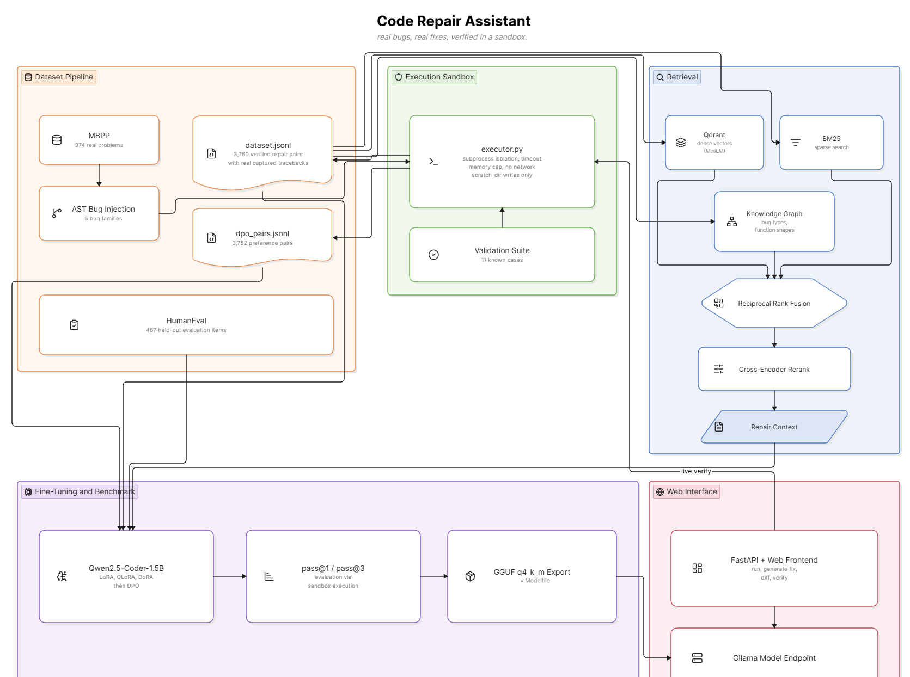

# Code Repair Assistant

A fine-tuned code-repair system: given a coding problem, a broken Python
solution, and the real error it produces, the model generates a fix that
is verified by executing it against the problem's real test cases --
never by LLM judgment.

Every claim the system makes is backed by actual code execution: dataset
labels, retrieval evaluation, model benchmarking, and the live UI's
pass/fail verdicts all come from running code in a sandboxed interpreter,
not from a model's opinion of its own output.

## Architecture



## How it works

**Sandboxed execution engine.** All code -- broken, fixed, or
model-generated -- runs inside an isolated subprocess with a timeout, a
hard memory limit, no network access, and file writes restricted to a
scratch directory. It reports pass/fail per test case along with the real
captured traceback. A validation suite of 11 known-outcome cases (timeouts,
memory limits, network attempts, filesystem escapes, syntax errors, and
more) confirms the sandbox behaves correctly before it's trusted with
anything else.

**Bug-injection dataset pipeline.** Starting from 974 real problems in
MBPP, each with a correct reference solution and real tests, the pipeline
injects one small, realistic bug per variant -- off-by-one, wrong
operator, wrong comparison, wrong variable, or a missing edge case --
using AST-level mutation so the change is precise and the code stays
syntactically valid. Every variant is executed in the sandbox and kept
only if it genuinely fails, with its real captured error stored alongside
it. This produces 3,760 verified (broken, fixed) training pairs and 3,752
DPO preference pairs. HumanEval is held out entirely as a separate
evaluation set, never touched during training.

**Hybrid retrieval (RAG + GraphRAG).** Before generating a fix, the
system retrieves similar past repairs using three signals in parallel --
dense vector search (Qdrant, MiniLM embeddings), BM25 sparse keyword
search, and a knowledge graph connecting examples by bug type and function
shape. The three are merged with Reciprocal Rank Fusion and reranked with
a cross-encoder, producing repair context for the generation step.

**Fine-tuning and benchmarking.** A Colab notebook fine-tunes
Qwen2.5-Coder-1.5B using three parameter-efficient methods -- LoRA, QLoRA,
and DoRA -- compares them on measured evaluation loss, and runs DPO on top
of the best adapter. Every model variant is benchmarked on the held-out
HumanEval set by executing its generated fixes through the same sandbox
and measuring pass@1 and pass@3, with a separate ablation isolating the
effect of retrieval context. The winning adapter is quantized to GGUF and
packaged as an Ollama model.

**Web interface.** A FastAPI backend and a static frontend let a user
paste in broken code, run it in the sandbox, generate a fix, view the
diff, and verify the fix by running it through the sandbox again -- live,
in the browser. The model it calls is a single configuration value, so
swapping in the fine-tuned adapter is a one-line change.

## Results

Measured, not estimated:

- **Sandbox validation:** 11/11 known-outcome cases pass.
- **Dataset:** 974 MBPP problems -> 3,760 verified-failing training pairs
  and 3,752 DPO pairs; 467 held-out HumanEval evaluation items.
- **Retrieval evaluation** (120 labeled queries, full-context mode):

  | System | recall@5 | recall@10 | nDCG@10 | MRR |
  |---|---|---|---|---|
  | dense only | 0.990 | 1.000 | 0.996 | 0.994 |
  | bm25 only | 0.988 | 1.000 | 0.985 | 0.977 |
  | graph only | 0.533 | 0.650 | 0.587 | 0.547 |
  | hybrid (RRF) | 0.992 | 1.000 | 0.993 | 0.990 |
  | hybrid + rerank | 0.981 | 0.990 | 0.984 | 0.981 |
  | hybrid + graph + rerank | 0.983 | 0.996 | 0.987 | 0.981 |

  In the harder code-only query mode (no problem description, just code
  and error), reranking measurably improves recall and nDCG; the graph
  signal on its own is weak and adds no measurable lift once hybrid
  search and reranking are already in place -- full numbers in
  `rag/eval_results.md`.
- **Fine-tuning and benchmark:** implemented in
  `notebook/code_repair_colab.ipynb`; results depend on the Colab GPU run.

## Repository structure

| Path | Description |
|---|---|
| `sandbox/executor.py` | Sandboxed execution engine used throughout the project |
| `sandbox/validate_sandbox.py` | 11-case validation suite for the sandbox |
| `data/mutations.py` | AST-level bug injection |
| `data/build_dataset.py` | Builds the MBPP training set with sandbox-verified pairs |
| `data/build_eval_set.py` | Builds the held-out HumanEval evaluation set |
| `data/add_context_to_eval.py` | Precomputes retrieval context for evaluation items |
| `rag/store.py`, `rag/build_index.py` | Dense (Qdrant) and BM25 index construction |
| `rag/graph.py` | Knowledge graph and multi-hop candidate retrieval |
| `rag/retriever.py` | Hybrid retrieval pipeline (RRF + graph + rerank) |
| `rag/retrieval_eval.py` | Retrieval evaluation (recall@k, nDCG, MRR) |
| `notebook/code_repair_colab.ipynb` | Fine-tuning and benchmarking (Colab, GPU) |
| `ui/server.py`, `ui/static/` | Web interface backend and frontend |
| `ui/config.py` | Model and runtime configuration |
| `ui/test_e2e.py` | End-to-end test of the full UI pipeline |

## Getting started

```bash
pip install -r requirements.txt

python sandbox/validate_sandbox.py     # verify the sandbox
python data/build_dataset.py           # build the training dataset
python data/build_eval_set.py          # build the held-out evaluation set
python rag/build_index.py              # build the retrieval index
uvicorn ui.server:app --port 8000      # launch the web interface
```

Fine-tuning and benchmarking are run separately on a GPU via
`notebook/code_repair_colab.ipynb`.
