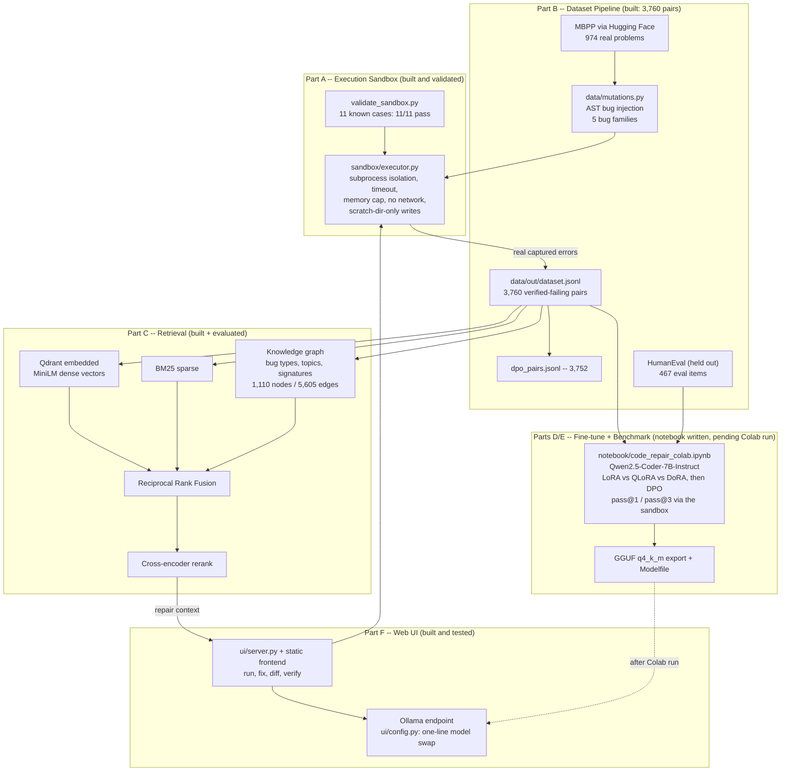

# Code Repair Assistant

A fine-tuned code-repair system: given a coding problem, a broken Python
solution, and the real error it produces, the model generates a fix that is
verified by actually executing it against the problem's real test cases --
never by LLM judgment.

Everything is grounded in real data: problems, reference solutions and tests
come from MBPP (training) and HumanEval (held-out evaluation only). The one
deliberately synthetic step is bug injection -- and every injected bug is
executed in a sandbox and kept only if it genuinely fails, with its actual
captured traceback stored as the error.

## Architecture

## Eraser.io diagram prompt

Paste this into Eraser.io's AI diagram feature for the same picture:

> Draw a system architecture diagram titled "Code Repair Assistant" with five
> groups. Group 1 "Execution Sandbox": a box "executor.py: subprocess
> isolation, timeout, memory cap, no network, scratch-dir writes only" and a
> box "validation suite: 11 known cases" pointing to it. Group 2 "Dataset
> Pipeline": "MBPP (974 real problems, Hugging Face)" flows into "AST bug
> injection (5 bug families)" which flows into the sandbox; the sandbox
> outputs "dataset.jsonl: 3,760 verified-failing repair pairs with real
> captured tracebacks" and "dpo_pairs.jsonl: 3,752 preference pairs";
> a separate box "HumanEval: 467 held-out eval items, never used in
> training". Group 3 "Retrieval": dataset.jsonl feeds three parallel boxes
> "Qdrant dense vectors (MiniLM)", "BM25 sparse", and "knowledge graph
> (bug types, function topics, signature shapes)"; all three merge into
> "Reciprocal Rank Fusion" then "cross-encoder rerank". Group 4 "Fine-tuning
> and Benchmark (Colab, pending)": dataset and HumanEval feed a notebook box
> "Qwen2.5-Coder-7B: LoRA vs QLoRA vs DoRA, then DPO; pass@1/pass@3 measured
> by executing fixes in the sandbox", which outputs "GGUF q4_k_m + Modelfile
> for Ollama". Group 5 "Web UI": a box "FastAPI + static frontend: run code,
> generate fix, diff view, verify fix" connected to "Ollama endpoint
> (configurable model)" and to the sandbox; the rerank output feeds the UI
> as repair context; the GGUF export connects to Ollama with a dashed
> "after Colab run" arrow.

## Repository layout

| Path | What it is |
|---|---|
| `sandbox/executor.py` | Safe execution engine (Part A); reused by every later part |
| `sandbox/validate_sandbox.py` | 11-case validation suite for the sandbox itself |
| `data/mutations.py` | AST-level bug injection (the one intentional synthetic step) |
| `data/build_dataset.py` | MBPP -> 3,760 sandbox-verified repair pairs + DPO pairs + report |
| `data/build_eval_set.py` | HumanEval -> 467 held-out eval items (never trained on) |
| `data/add_context_to_eval.py` | Precomputes real retrieval context for eval items |
| `rag/store.py`, `rag/build_index.py` | Dense (Qdrant) + BM25 indexes over the dataset |
| `rag/graph.py` | Knowledge graph + multi-hop candidate lookup |
| `rag/retriever.py` | Hybrid RRF + graph + cross-encoder pipeline |
| `rag/retrieval_eval.py` | Recall@k / nDCG / MRR on a real labeled query set |
| `notebook/code_repair_colab.ipynb` | Parts D/E: fine-tuning + benchmark (run on Colab L4) |
| `ui/server.py`, `ui/static/` | Web interface; every verdict comes from a real sandbox run |
| `ui/config.py` | `OLLAMA_MODEL` -- the one-line model swap |
| `ui/test_e2e.py` | Scripted end-to-end check of the whole UI loop |
| `PROJECT_EXPLAINED.md` | Plain-English walkthrough of every file (interview prep) |
| `RUNBOOK.md` | Exact commands to run everything, with time estimates |

## Status

Parts A, B, C, F are built and executed on real data with measured results
(see `data/out/report.md`, `data/out/eval_set_report.md`,
`rag/eval_results.md`). Parts D and E are written and validated but not
executed -- they require a Colab L4 GPU; every result cell prints measured
values only and ships with empty outputs.
